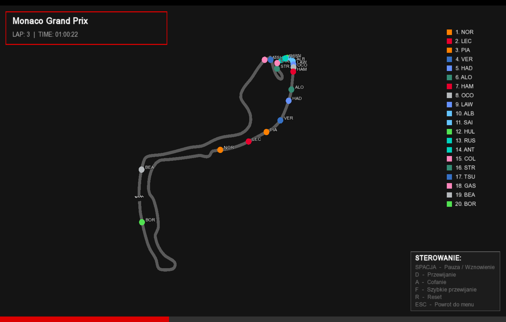

# Wizualizator Wyścigów F1

Aplikacja w C++ z interfejsem graficznym (SFML) oraz skryptem w Pythonie, służąca do pobierania, analizowania i wizualizacji danych z wyścigów Formuły 1.


## Kluczowe funkcjonalności
* **Moduł pobierania danych (Python):** Skrypt automatycznie łączy się z API biblioteki `FastF1`, skąd wyciąga szczegółowe czasy okrążeń, statystyki kierowców oraz pełne wyniki z sesji wyścigowych.


* **Warstwa przechowywania (JSON):** Wszystkie pobrane informacje są porządkowane i zapisywane w pliku `races_all.json`. Dzięki temu aplikacja zapamiętuje wyścigi i przy kolejnym uruchomieniu ładuje je błyskawicznie – nawet bez dostępu do internetu.


* **Silnik renderowania grafiki (C++ / SFML):** Projekt posiada dedykowane okno graficzne zbudowane w C++. Odpowiada ono za płynne renderowanie interfejsu, obsługę menu oraz wizualizację przebiegu sesji wyścigowych Formuły 1.


## Jak uruchomić projekt lokalnie

Wybierz instrukcję dedykowaną dla Twojego systemu operacyjnego:

---

### Instrukcja dla systemu Windows (CLion + vcpkg)

#### 1. Wymagania wstępne
* Kompilator **C++** wspierający standard C++17 lub nowszy (np. MSVC lub MinGW zintegrowane z CLion).
* Zainstalowane środowisko **Python** (wersja 3.8 lub nowsza).
* Menedżer pakietów **vcpkg** zintegrowany z Twoim IDE.

#### 2. Konfiguracja środowiska Python
Uruchom terminal w folderze projektu i przygotuj środowisko wirtualne:
```bash
# Tworzenie wirtualnego środowiska
python -m venv f1env

# Aktywacja środowiska na Windows
f1env\Scripts\activate

# Instalacja bibliotek
pip install fastf1 requests
```
#### 3. Kompilacja C++
Projekt używa vcpkg w trybie manifestu, co automatycznie załatwia konfigurację bibliotek:

1. Otwórz główny folder projektu w CLion.
2. Upewnij się, że w ustawieniach IDE (Settings -> Build, Execution, Deployment -> vcpkg) masz włączone wsparcie dla tego menedżera.
3. CLion automatycznie wykryje plik CMakeLists.txt oraz manifest, pobierając właściwe wersje bibliotek **sfml** oraz **nlohmann-json**.
4. Po zakończeniu indeksowania projektu kliknij ikonę Build, a następnie Run.

---

### Instrukcja dla systemu macOS / Linux (Terminal + Homebrew)

#### 1. Wymagania wstępne
* Środowisko kompilatora (np. Xcode Command Line Tools zainstalowane komendą `xcode-select --install`).
* Zainstalowany menedżer pakietów **Homebrew**.
* Zainstalowane środowisko **Python** (wersja 3.8 lub nowsza).

#### 2. Instalacja bibliotek systemowych
Przed otwarciem projektu musisz zainstalować wymagane pakiety bezpośrednio w systemie za pomocą Homebrew. Otwórz systemowy Terminal i wpisz:
```bash
brew install sfml nlohmann-json
```

#### 3. Konfiguracja środowiska Python
W terminalu przejdź do folderu projektu i przygotuj środowisko wirtualnego:
```bash
# Tworzenie wirtualnego środowiska
python3 -m venv f1env

# Aktywacja środowiska na macOS / Linux
source f1env/bin/activate

# Instalacja bibliotek
pip install fastf1 requests
```

#### 4. Kompilacja C++
1. Otwórz folder projektu w środowisku CLion.
2. Ponieważ biblioteki zostały zainstalowane globalnie przez Homebrew, CMake automatycznie znajdzie je w ścieżkach systemowych.
3. Kliknij ikonę Build, a następnie Run.

## Co jeśli brakuje pliku `races_all.json`?
Jeśli plik z danymi wyścigowymi nie pobrał się automatycznie lub chcesz zaktualizować bazę danych o nowe wyścigi, musisz uruchomić skrypt Python, który pobierze świeże dane z API i sam wygeneruje ten plik.

Aby to zrobić, po aktywacji środowiska wirtualnego uruchom w terminalu komendę:
```bash
python "f1 python.py"
```
Skrypt połączy się z API `FastF1` i pobierze wybrane statystyki.

Następnie wpisz w terminalu komendę:
```bash
cp races_all.json cmake-build-debug/races_all.json
```
Wówczas plik `races_all.json` zostaje automatycznie zaktualizowany i gotowy do użycia.


## Struktura plików
```text
.
├── CMakeLists.txt      # Konfiguracja budowania projektu C++ (CMake)
├── main.cpp            # Główny kod źródłowy aplikacji i pętla graficzna SFML
├── f1 python.py        # Skrypt Python do pobierania telemetrii z API FastF1
├── races_all.json      # Lokalna baza danych w formacie JSON z wynikami wyścigów
└── logo.png            # Logotyp F1 wykorzystywany w interfejsie graficznym
```
